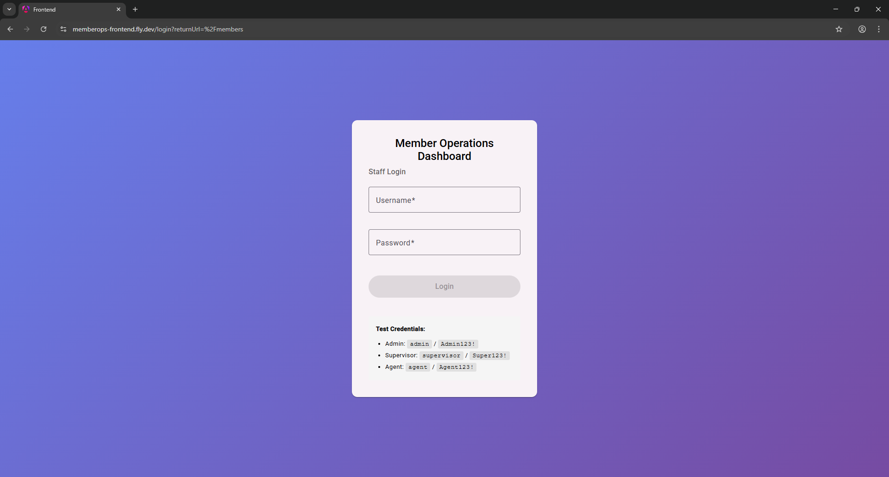
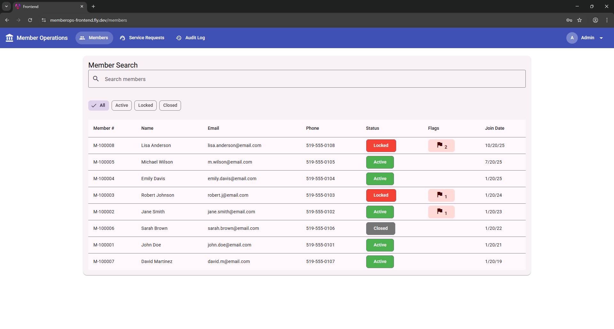
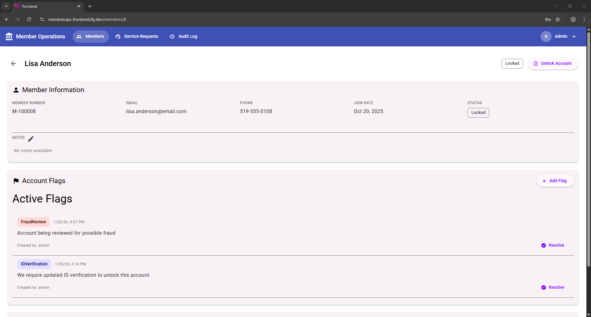
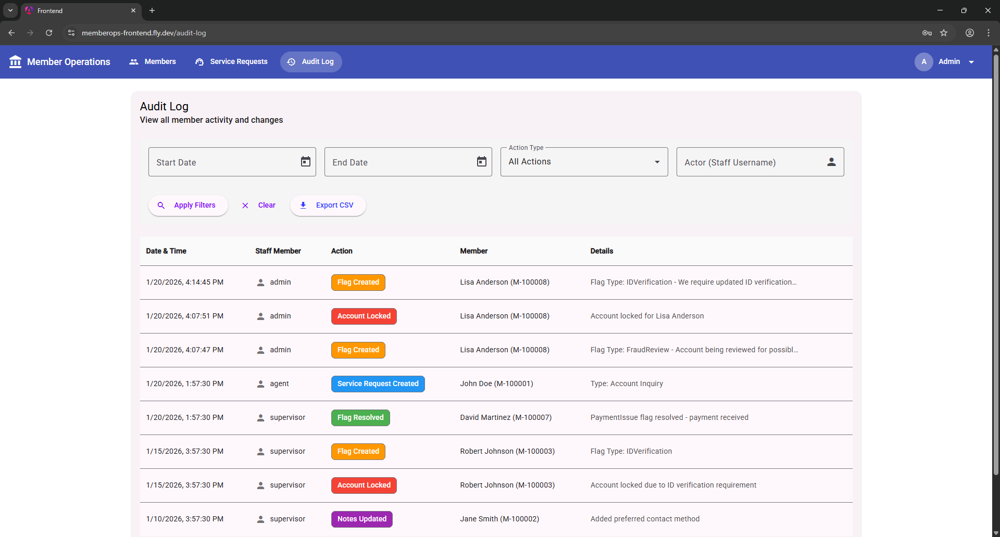
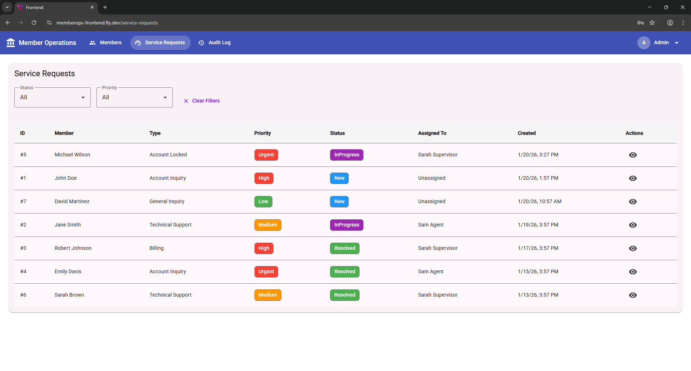
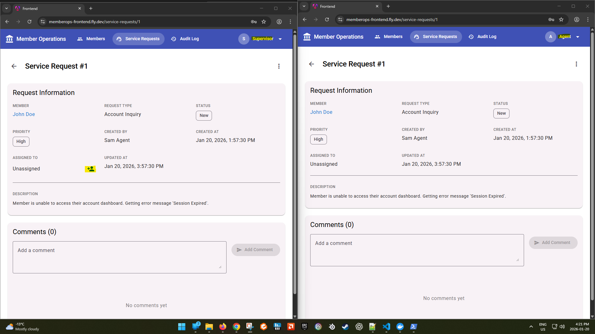

# Member Operations Dashboard

[](https://memberops-frontend.fly.dev)
[](https://angular.io/)
[](https://dotnet.microsoft.com/)
[](https://www.postgresql.org/)
[](https://www.typescriptlang.org/)
[](https://www.docker.com/)

An Angular + .NET portfolio project demonstrating enterprise staff tool patterns for credit union operations. Features member search, account flags, service request tracking, and audit logging with role-based access control.

This project showcases Angular expertise with standalone components, RxJS reactive patterns, Angular Material, and integration with a .NET 8 Web API backend using JWT authentication.

**Live Demo:** [https://memberops-frontend.fly.dev](https://memberops-frontend.fly.dev)

**Demo Credentials:**

| Username   | Password  | Role       |
| ---------- | --------- | ---------- |
| admin      | Admin123! | Admin      |
| supervisor | Super123! | Supervisor |
| agent      | Agent123! | Agent      |

---

## Features

### Staff Authentication

- JWT-based login with role-based access control
- Angular guards and HTTP interceptors
- Secure token management

### Member Search & List

- Search with RxJS debouncing (debounceTime, switchMap)
- Angular Material table with sorting and filtering
- Status indicators with colored chips

### Member Detail View

- Member information card with notes display
- Account status management
- Related flags and service requests

### Account Flags

- Create flags (Fraud Review, ID Verification, Payment Issue, General Review)
- Resolve flags with notes (Supervisor/Admin only)
- Flag history tracking

### Service Requests

- Track requests with status and priority
- Assign to staff members
- Add comments and update status
- Colored chips for status/priority visualization

### Audit Log Viewer

- Filter by date range, action type, staff member
- CSV export (Supervisor/Admin only)
- Complete activity history

### Administrative Actions

- Lock/Unlock member accounts (Supervisor/Admin only)
- Edit member notes (Supervisor/Admin only)

---

## 📸 Screenshots

### 🟦 Login Overview
<p>Shows the ability to login in as different users with different roles.</p>
<div style="display: flex; gap: 12px; margin-bottom: 20px;">
 
</div>

### 🟧 Member List
<p>Shows the current list of members along with their account status and a live count of flags. Debounced search allows searching by simply typing into the search box.</p>
<div style="display: flex; gap: 12px; margin-bottom: 20px;">
   
</div>

### 🟨 Member Detail
<p>Detailed member view showing flags and account status. The ability to resolve flags or unlock account is ppresent depending on user role.</p>
<div style="display: flex; gap: 12px; margin-bottom: 20px;">
   
</div>

### 🟨 Audit Log
<p>Available to admin and supervisor user, and shows the most recent actions taken in the application.</p>
<div style="display: flex; gap: 12px; margin-bottom: 20px;">
   
</div>

### 🟩 Service Request
<p>Displays a listing of customer service requests, along with status and priority.</p>
<div style="display: flex; gap: 12px; margin-bottom: 20px;">
    
</div>

### 🟦 Role Based Actions
<p>Available actions are defined by user role. For example, Supervisor has the ability to assing service requests to other staff memember, agent does not.</p>
<div style="display: flex; gap: 12px; margin-bottom: 20px;">
 
</div>

---

## Tech Stack

### Frontend (Angular 18)

| Technology           | Purpose                              |
| -------------------- | ------------------------------------ |
| **Angular 18**       | UI framework (standalone components) |
| **Angular Material** | UI component library                 |
| **RxJS**             | Reactive programming                 |
| **TypeScript 5**     | Type safety                          |
| **Jasmine + Karma**  | Unit testing (49 tests)              |

### Backend (ASP.NET Core 8)

| Technology                  | Purpose                    |
| --------------------------- | -------------------------- |
| **ASP.NET Core 8**          | Web API framework          |
| **Entity Framework Core 8** | ORM for PostgreSQL         |
| **JWT Bearer**              | Token-based authentication |
| **BCrypt.Net**              | Password hashing           |
| **xUnit**                   | Unit testing (50 tests)    |

### DevOps & Infrastructure

| Technology         | Purpose                       |
| ------------------ | ----------------------------- |
| **Docker**         | Containerization              |
| **Docker Compose** | Multi-container orchestration |
| **PostgreSQL 16**  | Database                      |

---

## Role-Based Permissions

| Feature                 | Agent | Supervisor | Admin |
| ----------------------- | :---: | :--------: | :---: |
| View members            |   ✓   |     ✓      |   ✓   |
| Search members          |   ✓   |     ✓      |   ✓   |
| View/Create flags       |   ✓   |     ✓      |   ✓   |
| Resolve flags           |   ✗   |     ✓      |   ✓   |
| Lock/unlock accounts    |   ✗   |     ✓      |   ✓   |
| Edit member notes       |   ✗   |     ✓      |   ✓   |
| View audit logs         |   ✓   |     ✓      |   ✓   |
| Export audit logs (CSV) |   ✗   |     ✓      |   ✓   |
| Manage service requests |   ✓   |     ✓      |   ✓   |

---

## Database Schema

### Staff

- `Id` (int) — Primary key
- `Username` (string) — Unique login identifier
- `PasswordHash` (string) — BCrypt hashed password
- `DisplayName` (string) — Display name
- `Email` (string) — Email address
- `Role` (string) — Agent, Supervisor, or Admin
- `CreatedAt` (DateTime) — Account creation timestamp

### Member

- `Id` (int) — Primary key
- `MemberNumber` (string) — Unique member identifier (e.g., "M-100001")
- `FirstName`, `LastName` (string) — Member name
- `Email`, `Phone` (string) — Contact information
- `Status` (string) — Active, Locked, or Closed
- `JoinDate` (DateTime) — Membership start date
- `Notes` (string?) — Staff notes
- Relations: Has many AccountFlags, ServiceRequests, AuditLogs

### AccountFlag

- `Id` (int) — Primary key
- `MemberId` (int) — Foreign key to Member
- `FlagType` (string) — FraudReview, IDVerification, PaymentIssue, GeneralReview
- `Description` (string) — Flag details
- `CreatedBy` (string) — Staff username who created
- `CreatedAt` (DateTime) — Creation timestamp
- `ResolvedBy` (string?) — Staff username who resolved
- `ResolvedAt` (DateTime?) — Resolution timestamp
- `ResolutionNotes` (string?) — Resolution details

### ServiceRequest

- `Id` (int) — Primary key
- `MemberId` (int) — Foreign key to Member
- `RequestType` (string) — Type of request
- `Description` (string) — Request details
- `Status` (enum) — New, InProgress, Resolved
- `Priority` (enum) — Low, Medium, High, Urgent
- `CreatedById`, `AssignedToId`, `ResolvedById` (int) — Foreign keys to Staff
- `ResolutionType` (enum?) — Resolved, MoreInfoNeeded, Transferred
- `ResolutionNotes` (string?) — Resolution details
- Relations: Has many ServiceRequestComments

### ServiceRequestComment

- `Id` (int) — Primary key
- `ServiceRequestId` (int) — Foreign key to ServiceRequest
- `StaffId` (int) — Foreign key to Staff
- `CommentText` (string) — Comment content
- `CreatedAt` (DateTime) — Comment timestamp

### AuditLog

- `Id` (int) — Primary key
- `MemberId` (int) — Foreign key to Member
- `Actor` (string) — Staff username who performed action
- `Action` (string) — Action performed
- `Details` (string?) — Additional details
- `Timestamp` (DateTime) — When action occurred

---

## API Endpoints

### Authentication (`/api/auth`)

| Method | Endpoint          | Description                  |
| ------ | ----------------- | ---------------------------- |
| `POST` | `/api/auth/login` | Login with username/password |

**Example Request:**

```json
{
  "username": "admin",
  "password": "Admin123!"
}
```

**Example Response:**

```json
{
  "token": "eyJhbGciOiJIUzI1NiIsInR5cCI6IkpXVCJ9...",
  "username": "admin",
  "displayName": "Admin User",
  "role": "Admin",
  "expiresAt": "2026-01-20T15:30:00Z"
}
```

### Members (`/api/members`)

| Method | Endpoint                   | Description         |    Auth     |
| ------ | -------------------------- | ------------------- | :---------: |
| `GET`  | `/api/members`             | List/search members |      ✓      |
| `GET`  | `/api/members/{id}`        | Get member details  |      ✓      |
| `PUT`  | `/api/members/{id}/lock`   | Lock account        | Supervisor+ |
| `PUT`  | `/api/members/{id}/unlock` | Unlock account      | Supervisor+ |
| `PUT`  | `/api/members/{id}/notes`  | Update notes        | Supervisor+ |

**Query Parameters:**

- `search` (string) — Filter by name, email, member number
- `status` (string) — Filter by status (Active, Locked, Closed)

### Account Flags (`/api/members/{memberId}/flags`)

| Method | Endpoint                                         | Description        |    Auth     |
| ------ | ------------------------------------------------ | ------------------ | :---------: |
| `GET`  | `/api/members/{memberId}/flags`                  | Get member's flags |      ✓      |
| `POST` | `/api/members/{memberId}/flags`                  | Create flag        |      ✓      |
| `PUT`  | `/api/members/{memberId}/flags/{flagId}/resolve` | Resolve flag       | Supervisor+ |

### Service Requests (`/api/servicerequests`)

| Method | Endpoint                             | Description           | Auth |
| ------ | ------------------------------------ | --------------------- | :--: |
| `GET`  | `/api/servicerequests`               | List service requests |  ✓   |
| `GET`  | `/api/servicerequests/{id}`          | Get request details   |  ✓   |
| `PUT`  | `/api/servicerequests/{id}/status`   | Update status         |  ✓   |
| `PUT`  | `/api/servicerequests/{id}/assign`   | Assign to staff       |  ✓   |
| `POST` | `/api/servicerequests/{id}/comments` | Add comment           |  ✓   |

### Audit Log (`/api/auditlog`)

| Method | Endpoint               | Description                    |    Auth     |
| ------ | ---------------------- | ------------------------------ | :---------: |
| `GET`  | `/api/auditlog`        | List audit logs (with filters) |      ✓      |
| `GET`  | `/api/auditlog/export` | Export to CSV                  | Supervisor+ |

### Staff (`/api/staff`)

| Method | Endpoint     | Description            | Auth |
| ------ | ------------ | ---------------------- | :--: |
| `GET`  | `/api/staff` | List all staff members |  ✓   |

---

## Authentication Flow

### Login

1. User submits credentials via `/api/auth/login`
2. Backend verifies username/password with BCrypt
3. JWT token generated with claims (username, role)
4. Token stored in localStorage
5. Angular HTTP interceptor adds `Authorization: Bearer {token}` to all requests

### Protected Routes

- Angular `AuthGuard` protects all dashboard routes
- Angular `RoleGuard` restricts Supervisor/Admin features
- Unauthenticated users redirected to login page
- JWT expiration handled with automatic logout

### Role-Based UI

- UI elements conditionally rendered based on user role
- Supervisor/Admin actions hidden from Agent users
- Backend enforces authorization on all protected endpoints

---

## Quick Start

### Prerequisites

- Node.js 20+
- .NET 8 SDK
- Docker Desktop

### Option 1: Docker Compose (Recommended)

Start all services with a single command:

```bash
docker-compose up -d
```

Access the application:

- **Frontend**: http://localhost:4200
- **API**: http://localhost:5293
- **Swagger**: http://localhost:5293/swagger

### Option 2: Manual Setup

1. **Start PostgreSQL**:

```bash
docker-compose up -d postgres
```

2. **Run the API**:

```bash
cd backend/MemberOpsAPI
dotnet run
```

3. **Run the Frontend**:

```bash
cd frontend
npm install
npm start
```

Access the application:

- **Frontend**: http://localhost:4200
- **API**: http://localhost:5293

---

## Test Credentials

| Username   | Password  | Role       |
| ---------- | --------- | ---------- |
| admin      | Admin123! | Admin      |
| supervisor | Super123! | Supervisor |
| agent      | Agent123! | Agent      |

---

## Running Tests

### Angular Tests (49 tests)

```bash
cd frontend
npm test
```

**Test Coverage:**

- AuthService (login, logout, token management)
- MemberService (API calls, error handling)
- AuthGuard (route protection)
- RoleGuard (role-based access)
- AppComponent

### .NET Tests (50 tests)

```bash
cd backend
dotnet test
```

**Test Coverage:**

- AuthController (login, JWT generation, claims)
- MembersController (CRUD, lock/unlock, notes)
- AccountFlagsController (create, resolve)
- Role-based authorization

---

## Project Structure

```
member-ops-dashboard/
├── frontend/                    # Angular application
│   └── src/
│       └── app/
│           ├── core/            # Guards, interceptors, services
│           │   ├── guards/
│           │   │   ├── auth.guard.ts
│           │   │   └── role.guard.ts
│           │   ├── interceptors/
│           │   │   ├── auth.interceptor.ts
│           │   │   └── error.interceptor.ts
│           │   └── services/
│           │       └── auth.service.ts
│           ├── features/        # Feature modules
│           │   ├── auth/
│           │   ├── members/
│           │   ├── flags/
│           │   ├── service-requests/
│           │   └── audit-log/
│           └── shared/          # Shared components, pipes
│
├── backend/                     # .NET API
│   ├── MemberOpsAPI/
│   │   ├── Controllers/
│   │   ├── Models/
│   │   ├── Data/
│   │   ├── DTOs/
│   │   └── Constants/
│   └── MemberOpsAPI.Tests/      # xUnit tests
│       ├── Controllers/
│       └── Authorization/
│
├── docker-compose.yml
└── README.md
```

---

## Key Design Patterns

### Angular Patterns

- **Standalone Components** — Modern Angular architecture without NgModules
- **RxJS Operators** — debounceTime, switchMap, distinctUntilChanged for search
- **Route Guards** — AuthGuard and RoleGuard for access control
- **HTTP Interceptors** — Token injection and error handling
- **Reactive Forms** — Form validation with Angular Material
- **Service Layer** — Centralized API communication

### .NET Patterns

- **Controller Layer** — RESTful API endpoints
- **Entity Framework Core** — ORM with PostgreSQL
- **JWT Authentication** — Stateless token-based auth
- **Role-Based Authorization** — [Authorize(Roles = "...")] attributes
- **Audit Logging** — Automatic activity tracking
- **Dependency Injection** — ASP.NET Core built-in DI

### Database Patterns

- **Foreign Keys** — Referential integrity enforced
- **Cascade Delete** — Member deletion cascades to related records
- **Unique Constraints** — MemberNumber, Username
- **Indexes** — Optimized queries on frequently accessed columns

---

## Security Considerations

1. **Password Hashing** — BCrypt with salt
2. **JWT Tokens** — Signed with secret key, 60-minute expiration
3. **Role Authorization** — Backend enforces all permission checks
4. **Input Validation** — Server-side validation on all endpoints
5. **SQL Injection** — Protected via Entity Framework parameterization
6. **CORS** — Configured for specific frontend origins

---

## Author

**James Dunford**

Full-stack portfolio project demonstrating Angular enterprise patterns, .NET API development, JWT authentication, and role-based access control.

- GitHub: [@JamesD9406](https://github.com/JamesD9406)

---

## Acknowledgments

- **Angular** — Google's web application framework
- **Angular Material** — Material Design components for Angular
- **ASP.NET Core** — Microsoft's cross-platform framework
- **PostgreSQL** — Open-source relational database
- **Docker** — Containerization platform

---

## License

This is a portfolio project for demonstration purposes.
